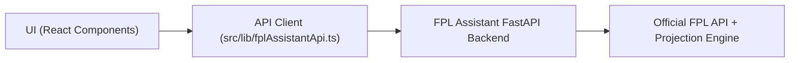

# FPL Decision Hub (Frontend)

Frontend app for the FPL Assistant demo.  
It shows squad visualization, recommended lineup, transfer planner, and chip scenario views powered by the backend API.

## Live Demo Links

- Frontend URL: `<YOUR_FRONTEND_URL>`
- Backend API URL: `<YOUR_BACKEND_URL>`
- Backend docs: `<YOUR_BACKEND_URL>/docs`
- Loom walkthrough: `<YOUR_LOOM_URL>`

## What This Frontend Does

- Loads your FPL squad for a selected gameweek.
- Shows optimized pitch lineup and bench in a clear visual format.
- Displays transfer recommendations and lets you apply suggested moves step-by-step.
- Supports chip strategy mode:
  - `No chip`
  - `Free Hit` (1 GW focus)
  - `Wildcard` (horizon focus)
- Surfaces recommendation metadata (target GW, horizon, timing, chip budget info).

## Tech Stack

- React + TypeScript + Vite
- Tailwind CSS + shadcn/ui
- TanStack Query for API data/mutations

## Architecture Overview



## Local Setup

```bash
cd fpl-decision-hub
npm install
npm run dev
```

Build:

```bash
npm run build
```

## Required Environment Variables

Create `.env` with:

```bash
VITE_FPL_API_BASE_URL=https://<YOUR_BACKEND_URL>
VITE_FPL_SQUAD_URL=/squad?entry_id={entry_id}&event_id={event_id}
VITE_FPL_RECOMMENDATION_URL=/recommendations?entry_id={entry_id}&event_id={event_id}&horizon_gws={horizon_gws}&include_transfers={include_transfers}
VITE_FPL_NEXT_EVENT_URL=/events/next
```

Optional:

```bash
VITE_FPL_FIXTURES_URL=/fixtures?event_id={event_id}
```

## Main User Flow (Demo)

1. Enter `Entry ID`.
2. Select target GW + horizon.
3. Choose chip strategy (`No chip`, `Free Hit`, `Wildcard`).
4. Click **Recommend Squad**.
5. Review pitch, captain/vice, transfer plan, and insights.
6. Apply transfer steps directly in UI.

## Deployment

- **Lovable publish**: use Share → Publish.
- **Alternative**: Vercel/Netlify static deploy with env variables above.
- Ensure backend CORS allows your frontend domain.

## Project Structure

- `src/pages/Index.tsx` — page state + query orchestration
- `src/lib/fplAssistantApi.ts` — typed API models and request builders
- `src/components/PitchVisualization.tsx` — pitch layout and lineup rendering
- `src/components/RecommendationsPanel.tsx` — insights + transfer summary
- `src/components/ParameterSidebar.tsx` — controls (GW, horizon, chip mode)

## Related Repos

- Backend API: `<YOUR_BACKEND_REPO_URL>`
